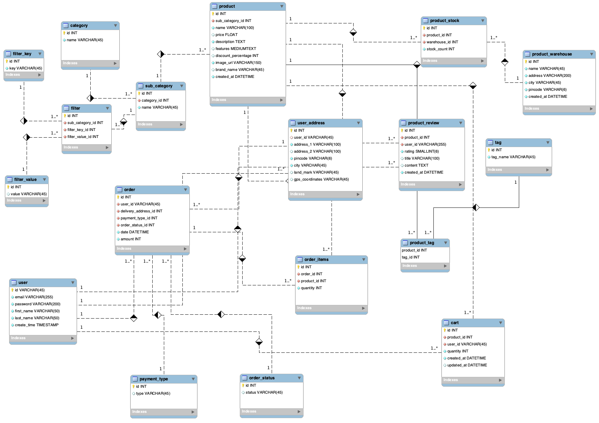

# Shopping Cart - (Under Development)
This is a mini Shopping Cart web app that is built on React.js on the front end and Node.js on the backend. It follows the micro-service architecture.

## TechStack
 - React.js
 - Node.js
 - GraphQL (Apollo Server and Client)
 - MySQL
 - Docker
 - Nginx
 - Consul Discovery Service
 - Kafka

## Architecture

## Database Model
